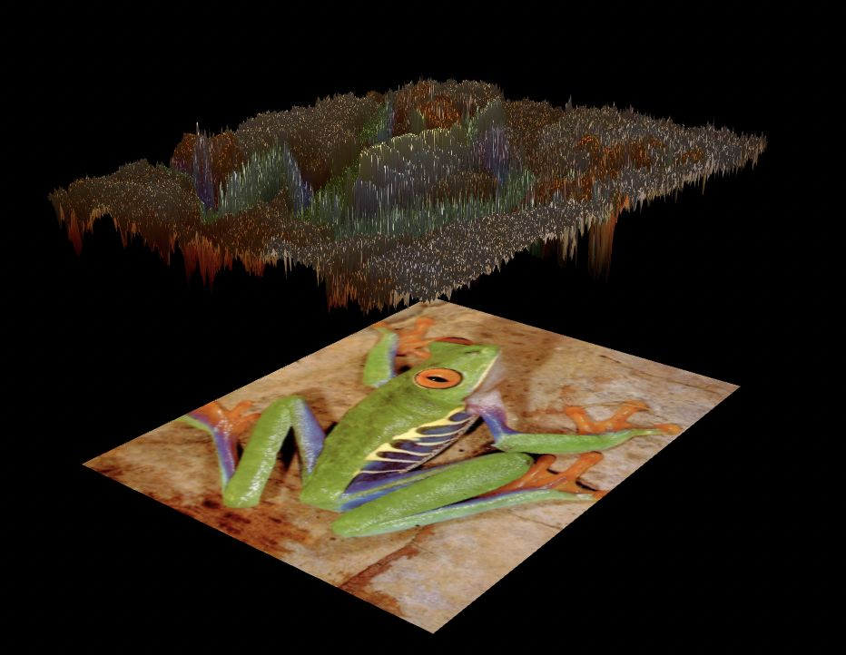

# Shaders and Color Sciences

> **Live demo →** https://ossama971.github.io/Shaders-and-Color-Sciences/

A frog photo walks into six different color spaces. Three exercises take the same source image — sometimes a video — and look at it from increasingly unusual angles: first as a scatter plot of raw color data floating in 3D, then as terrain shaped by a single channel value, then as that terrain under a directional light. All color-space mathematics runs entirely on the GPU in custom GLSL shaders. Nothing to install, nothing to compile — open an HTML file and you are inside. All three exercises are also fully viewable in **VR** and **AR/MR** via WebXR; the scene repositions itself automatically and a floating control panel appears for hands-free navigation.

| RGB Point Cloud | Lambertian Elevation |
|:---:|:---:|
|  |  |

---

## What's in Here

The project is three independent exercises that share a common asset (the frog image and a short video clip) and a shared WebXR helper module. Each exercise is a self-contained HTML page you can open on its own. Click a heading below to jump to its full technical breakdown.

**[Exercise 1 — Color-Space Point-Cloud Visualization](#exercise-1--color-space-point-cloud-visualization)**
Every pixel of the source image or live video stream becomes a 3D point whose position is determined by converting its sRGB value into one of six color spaces — sRGB, HSV, CIEXYZ, CIExyY, CIELAB, CIELCH — entirely on the GPU in a custom GLSL vertex shader. The result is a scatter plot of the image's color distribution that reveals the geometry of how colors cluster in each space. Two render modes are available: direct (opaque round points) and density (additive-blended soft sprites that accumulate where colors overlap). A separate shadow pass projects the cloud's silhouette onto the floor below.

**[Exercise 2 — Color-Driven Elevation Maps](#exercise-2--color-driven-elevation-maps)**
The same image is stretched over a subdivided plane and each vertex is displaced along Z by the value of one channel extracted from a selected color space. Switching the channel selector changes what drives the terrain height — the L\* channel produces a faithful topography of the scene's luminance; the b\* channel turns the frog's yellow skin into ridges and the green background into valleys. A flat reference image sits below the displaced surface for comparison.

**[Exercise 3 — Lambertian Lighting on Elevation Maps](#exercise-3--lambertian-lighting-on-elevation-maps)**
Extends the elevation map with physically-based diffuse shading. Per-vertex surface normals are computed on the GPU via a central-difference finite-difference scheme, and the Lambertian irradiance equation `I = Ia·ka + Id·kd·max(0, N·L)` is evaluated in the fragment shader. The same color-space and channel selectors from Exercise 2 stay live, so you can see how different channels produce different surface topographies and different lighting responses at the same time.

---

## Running It

No build step — every page is a static HTML file. A local HTTP server is required because browsers block ES module imports over `file://` and `VideoTexture` needs a proper origin.

```bash
# Python 3
python3 -m http.server 8080

# Node
npx serve .
```

Then open `http://localhost:8080`. The landing page links to all three exercises.

> **WebXR** needs HTTPS or `localhost`. Chrome on Android and Meta Browser on Quest both work out of the box.

---

## Tech Stack

| | |
|---|---|
| Rendering | Three.js r0.182.0 (unpkg CDN, ES module importmap) |
| Module shim | es-module-shims v1.3.6 (broadens importmap browser support) |
| Debug GUI | lil-gui v0.19.2 (CDN) |
| XR entry | WebXR Device API — `VRButton` / `ARButton` |
| Shaders | Custom GLSL in inline `<script type="x-shader/x-vertex">` blocks |
| Build | None |

---

## Project Structure

```
index.html                              # Landing page — links to all three exercises
xr_support.js                           # Shared WebXR setup (VRButton, ARButton, world placement)
README.md
assets/
  grenouille.jpg                        # Source image (frog)
  grenouille-gaus.jpg
  video-lowQ.mp4                        # Source video stream
Figures/
  rgb-img.jpeg                          # Screenshot — RGB point cloud
  lab-img.jpeg                          # Screenshot — CIELAB point cloud
  elevation.jpeg                        # Screenshot — color-driven elevation map
  lamb-elevation.jpeg                   # Screenshot — Lambertian-lit elevation map
  video-rgb.mp4                         # Screen recording — point cloud with video source
01-point-cloud-visualization/
  ex1.html                              # Shader definitions: point-cloud, shadow, texture pass-through
  ex1.js                                # Three.js scene, GUI, XR panel
02-color-elevation-maps/
  ex2.html                              # Shader definitions: elevation, texture pass-through
  ex2.js                                # Three.js scene, GUI, XR panel
03-lambertian-lighting/
  ex3.html                              # Shader definitions: elevation + Lambertian lighting
  ex3.js                                # Three.js scene, GUI, XR panel
```

---

## Exercise 1 — Color-Space Point-Cloud Visualization

**Files:** `01-point-cloud-visualization/ex1.html`, `01-point-cloud-visualization/ex1.js`

| RGB | CIELAB |
|:---:|:---:|
|  |  |

### Rendering Pipeline

Each pixel is represented as a `THREE.Points` vertex carrying a `gridUV` attribute — its normalised `(u, v)` texture coordinate. A custom GLSL vertex shader fetches the pixel's sRGB value from a `sampler2D` uniform, converts it to the target color space entirely on the GPU, and writes the result directly to `gl_Position`. No CPU-side color conversion is performed.

A subsample factor (`SUBSAMPLE_FACTOR = 2` by default, UI-adjustable 1–8) controls how many pixels become vertices. At 1/1 every pixel is a point; at 1/8 every 8th pixel is sampled.

### Color Space Conversions (GLSL)

All conversions are implemented from scratch in a shared `shaderConversions` GLSL snippet that is prepended at runtime to both the point-cloud and shadow vertex shaders.

| Space | Shader mode | Axes (X / Y / Z) | Key formula |
|-------|-------------|-------------------|-------------|
| **sRGB** | `0` | R / B / G | Identity |
| **HSV** | `1` | H / V / S | Hexagonal sector decomposition via `max(R,G,B)` |
| **CIEXYZ** | `2` | X/Xn / Y / Z/Zn | sRGB → linear via per-channel gamma (`pow(…, 2.4)`), then IEC 61966-2-1 matrix multiplication |
| **CIExyY** | `3` | x-chroma / Y-luma / y-chroma | `x = X/(X+Y+Z)`, `y = Y/(X+Y+Z)` |
| **CIELAB** | `4` | a\* / L\* / b\* | `L* = 116·f(Y/Yn) − 16`, `a* = 500·(f(X/Xn) − f(Y/Yn))`, `b* = 200·(f(Y/Yn) − f(Z/Zn))` with piecewise `labF(t)` and `δ = 6/29` |
| **CIELCH** | `5` | C\* / L\* / H_norm | `C* = √(a*² + b*²)`, `H = atan2(b*, a*)` normalised to `[0, 1]` |

**sRGB → linear electro-optical transfer:**
```glsl
vec3 srgbToLinear(vec3 c) {
    vec3 low  = c / 12.92;
    vec3 high = pow((c + 0.055) / 1.055, vec3(2.4));
    return mix(low, high, step(vec3(0.04045), c));
}
```
The `step`/`mix` pattern avoids branching so every vertex is converted in parallel with no divergence.

**sRGB → CIEXYZ matrix (D65 white point, column-major for GLSL `mat3`):**
```glsl
mat3 m = mat3(
    0.4124564, 0.2126729, 0.0193339,
    0.3575761, 0.7151522, 0.1191920,
    0.1804375, 0.0721750, 0.9503041
);
```

### Visual Modes

| Mode | Render | Blending |
|------|--------|----------|
| **Direct** | Round point sprites, opaque, depth write on | — |
| **Density** | Larger soft-edged sprites, `AdditiveBlending`, depth write off | Dense color clusters accumulate brightness |

### Shadow Pass

A separate lower-resolution cloud (`shadowSubsample = 4×`) is drawn with `MultiplyBlending` onto a horizontal floor plane at `y = 0.251`. Points project downward — x/z driven by R/G (or H/S in HSV mode) — and their alpha fades by brightness (B channel or HSV value), so darker colors cast lighter shadows.

### Media Pipeline

Both a static JPEG and an MP4 video stream are supported as sources. Switching replaces `pointsTex` in all shader uniforms without rebuilding the scene graph; geometry is only rebuilt when the new source has different pixel dimensions.

`THREE.NoColorSpace` is applied to all textures so the WebGL hardware sRGB decode is bypassed — the shader receives raw 0–1 sRGB bytes as expected by the conversion functions.

---

## Exercise 2 — Color-Driven Elevation Maps

**Files:** `02-color-elevation-maps/ex2.html`, `02-color-elevation-maps/ex2.js`


### Vertex Displacement

The mesh is a `PlaneGeometry` with `⌊w/DISCRET⌋ × ⌊h/DISCRET⌋` segments (`DISCRET = 2`), rendered with a `ShaderMaterial`. In the vertex shader, the height scalar is produced by:

1. Sampling the input texture at the vertex UV.
2. Passing the sRGB sample through `extractChannel(srgb, colorSpaceMode, channelIndex)`.
3. Adding `h * scaleElevation` to `position.z` (`scaleElevation = 0.75`).

```glsl
float h = extractChannel(srgb, colorSpaceMode, channelIndex);
pos.z  += h * scaleElevation;
```

### `extractChannel` Normalisation

Each space maps its three channels to `[0, 1]` for use as a height scalar:

| Space | Ch 0 | Ch 1 | Ch 2 | Normalisation |
|-------|------|------|------|---------------|
| sRGB | R | G | B | Already `[0, 1]` |
| HSV | H | S | V | Already `[0, 1]` |
| CIEXYZ | X | Y | Z | X÷0.95047, Y÷1.0, Z÷1.08883 (D65 white point) |
| CIExyY | x | y | Y | x and y naturally `[0, ~0.8]`; Y `[0, 1]` |
| CIELAB | L\* | a\* | b\* | L\*÷100; a\* → `(a*+128)/255`; b\* → `(b*+128)/255` |
| CIELCH | L\* | C\* | H | L\*÷100; C\*÷150 clamped; H already `[0, 1]` |

### Reference Image

A second flat `PlaneGeometry` with a pass-through fragment shader sits at `z = −1.5` below the displaced surface. It shows the original image colors so the elevated geometry can be compared directly against the unmodified source.

---

## Exercise 3 — Lambertian Lighting on Elevation Maps

**Files:** `03-lambertian-lighting/ex3.html`, `03-lambertian-lighting/ex3.js`


### Surface Normal Computation (Vertex Shader)

Four height samples are fetched at one-texel offsets in each direction:

```glsl
float hR = heightAt(vUv + vec2(texelSize.x, 0.0));
float hL = heightAt(vUv - vec2(texelSize.x, 0.0));
float hU = heightAt(vUv + vec2(0.0, texelSize.y));
float hD = heightAt(vUv - vec2(0.0, texelSize.y));

vec3 tangentU = vec3(2.0 * texelSize.x, 0.0, hR - hL);
vec3 tangentV = vec3(0.0, 2.0 * texelSize.y, hU - hD);
vNormal = normalize(cross(tangentU, tangentV));
```

The two tangent vectors span the local surface patch. Their cross product gives the surface normal, and because only direction matters, the texel-space step size cancels after `normalize()`. `texelSize = vec2(1/w, 1/h)` is updated whenever the source changes.

### Lambertian Irradiance (Fragment Shader)

```glsl
float I = Ia * ka + Id * kd * max(0.0, dot(N, L));
gl_FragColor = vec4(baseColor * I, 1.0);
```

| Uniform | Default | Role |
|---------|---------|------|
| `lightDir` | `normalize(1, 1, 1)` | Unit vector toward the directional light |
| `Id` | `1.0` | Directional light intensity |
| `kd` | `0.7` | Diffuse reflectance coefficient |
| `Ia` | `0.3` | Ambient light intensity |
| `ka` | `1.0` | Ambient reflectance coefficient |

The ambient floor (`Ia·ka = 0.3`) prevents any surface region from going fully black regardless of light angle. The base color is sampled directly from the input texture so the image's original colors are preserved and modulated by the irradiance.

---

## WebXR and VR

All three exercises ship the same WebXR integration via `xr_support.js`. VR and AR/MR entry buttons are injected into the page automatically.

### Session Modes

| Mode | Behaviour |
|------|-----------|
| **Desktop** | Standard orbit camera with `OrbitControls` |
| **VR** (immersive-vr) | Camera zeroed; world root repositioned and scaled for comfortable viewing |
| **AR/MR** (immersive-ar) | Scene background cleared for passthrough; world root placed at eye level |

### In-Headset Controls

A `THREE.Group` of canvas-texture buttons floats in the scene during an XR session. Each button renders on a `PlaneGeometry` with a `CanvasTexture` and highlights on hover. Two interaction methods are supported simultaneously:

- **Controller ray-casting** — `Raycaster` fires along the −Z forward vector of each `getController(i)`; `selectstart` triggers the press.
- **Hand tracking** — `getHand(i)` index-finger-tip joint world position is tested within a 6 cm proximity sphere around each button center.

### World Placement Per Exercise

| Exercise | `xrScale` | `xrWorldZOffset` | `arWorldYOffset` | Notes |
|----------|-----------|------------------|------------------|-------|
| 1 | 1.0 | −2.25 | −0.25 | Point cloud at comfortable arms-length |
| 2 | 0.35 | −3.5 | −1.1 | Tilted ~63° so both flat reference and elevated surface are visible |
| 3 | 0.35 | −3.5 | −1.1 | Same tilt as Exercise 2 to expose the lighting gradient |
