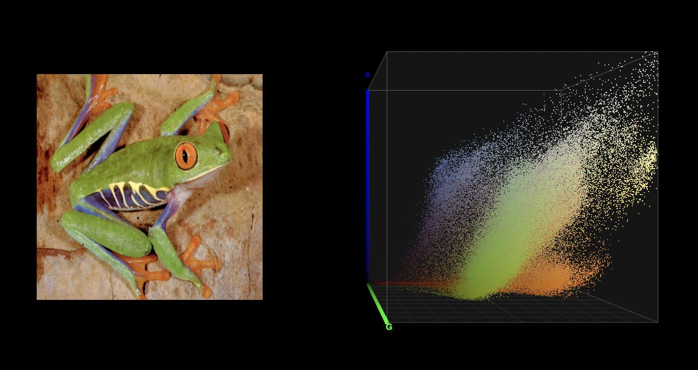
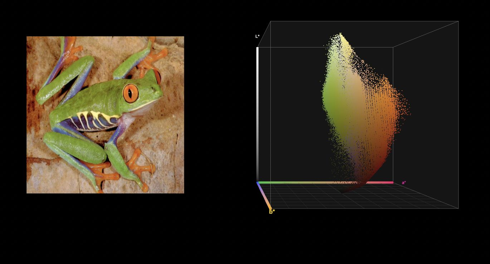
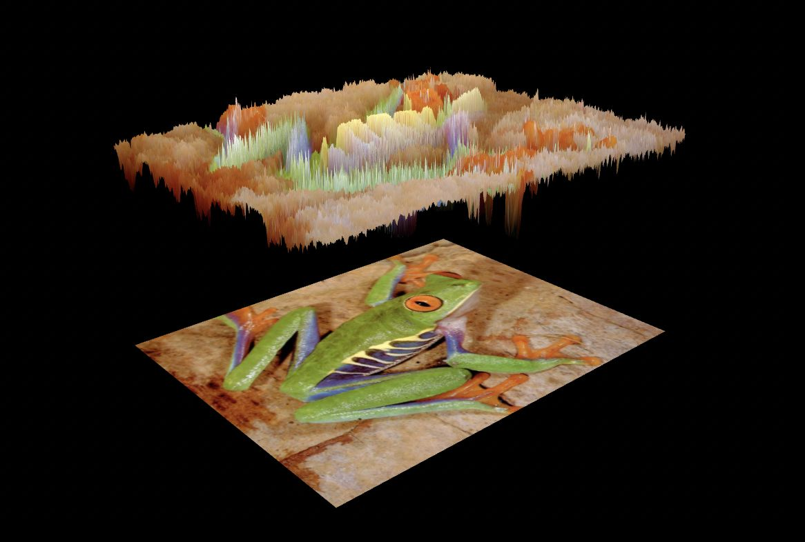

# Shaders and Color Sciences

> Three browser-based 3D visualization exercises. One confused frog. Six color spaces. Infinite ways to look at light.

This repository contains three progressively complex exercises that explore color perception, colorimetry, and lighting through interactive 3D visualizations. Every pixel of an image is treated as data — scattered into 3D space, folded into mountains, or lit by a simulated sun. No install required: everything runs in the browser as a static [Three.js](https://threejs.org/) ES module app.

All three exercises fully support **WebXR** — they can be experienced in **VR** (immersive-vr) or **AR/MR passthrough** (immersive-ar) on any compatible headset. A floating in-scene control panel appears automatically when an XR session starts, supporting both controller ray-casting and hand-tracking (index-finger-tip proximity).

**Live site:** [ossama971.github.io/Shaders-and-Color-Sciences](https://ossama971.github.io/Shaders-and-Color-Sciences/)

---

## Exercises

| # | Exercise | One-liner | Open |
|---|----------|-----------|------|
| 1 | [Color-Space Point-Cloud Visualization](#exercise-1--color-space-point-cloud-visualization) | Every image pixel plotted as a 3D point across six color spaces | [→ Open](exercise-1/ex1.html) |
| 2 | [Color-Driven Elevation Maps](#exercise-2--color-driven-elevation-maps) | A single color channel drives vertex displacement on a mesh | [→ Open](exercise-2/ex2.html) |
| 3 | [Lambertian Lighting on Elevation Maps](#exercise-3--lambertian-lighting-on-elevation-maps) | Finite-difference surface normals meet the Lambertian reflectance model | [→ Open](exercise-3/ex3.html) |

---

## Exercise 1 — Color-Space Point-Cloud Visualization

### Overview

Every pixel of an input image (or live video stream) is mapped to a 3D coordinate determined by its value in the selected color space. The result is a **color-space point cloud**: a three-dimensional scatter plot of the image's color distribution that reveals the geometric structure of how colors are clustered in each space.



*RGB point cloud — R on X, B on Y, G on Z. Neutral greys cluster along the diagonal; vivid greens from the frog dominate the G axis.*



*CIELAB point cloud — a\* on X (green↔magenta), b\* on Z (blue↔yellow), L\* on Y. The elongated vertical distribution reflects the wide luminance range of the image.*

### Technical Details

**Rendering pipeline**

- Each pixel is represented as a `THREE.Points` vertex with a `gridUV` attribute encoding its normalised texture coordinate `(u, v)`.
- A custom GLSL vertex shader fetches the pixel's sRGB value from a `sampler2D` uniform, converts it to the target color space entirely on the GPU, and writes the converted channels directly to `gl_Position`. No CPU-side color conversion is performed.
- A subsample factor (`SUBSAMPLE_FACTOR = 2` by default, UI-adjustable 1–8) controls how many pixels produce vertices. At `1/1` every pixel becomes a point; at `1/8` every 8th pixel is sampled.

**Color space conversions (GLSL)**

All conversions are implemented from scratch in `shaderConversions` — a shared GLSL snippet prepended to both the point-cloud and shadow vertex shaders at runtime.

| Space | Shader mode | Axes (X / Y / Z) | Key formula |
|-------|-------------|-------------------|-------------|
| **sRGB** | `0` | R / B / G | Identity |
| **HSV** | `1` | H / V / S | Hexagonal sector decomposition via `max(R,G,B)` |
| **CIEXYZ** | `2` | X/Xn / Y / Z/Zn | sRGB → linear via per-channel gamma (`pow(…, 2.4)`), then IEC 61966-2-1 matrix multiplication |
| **CIExyY** | `3` | x-chroma / Y-luma / y-chroma | `x = X/(X+Y+Z)`, `y = Y/(X+Y+Z)` |
| **CIELAB** | `4` | a\* / L\* / b\* | CIE standard: `L* = 116·f(Y/Yn) − 16`, `a* = 500·(f(X/Xn) − f(Y/Yn))`, `b* = 200·(f(Y/Yn) − f(Z/Zn))` using the piecewise `labF` function with `δ = 6/29` |
| **CIELCH** | `5` | C\* / L\* / H_norm | `C* = √(a*² + b*²)`, `H = atan2(b*, a*)` normalised to `[0, 1]` |

**sRGB → linear electro-optical transfer function:**
```glsl
vec3 srgbToLinear(vec3 c) {
    vec3 low  = c / 12.92;
    vec3 high = pow((c + 0.055) / 1.055, vec3(2.4));
    return mix(low, high, step(vec3(0.04045), c));
}
```
The `step`/`mix` construct avoids branching so the conversion runs efficiently on every vertex in parallel.

**sRGB → CIEXYZ matrix (D65 white point, column-major for GLSL `mat3`):**
```glsl
mat3 m = mat3(
    0.4124564, 0.2126729, 0.0193339,
    0.3575761, 0.7151522, 0.1191920,
    0.1804375, 0.0721750, 0.9503041
);
```

**Visual modes**

| Mode | Render | Blending |
|------|--------|----------|
| **Direct** | Round point sprites, opaque, depth write on | — |
| **Density** | Larger soft-edged sprites, `AdditiveBlending`, depth write off | Points accumulate: dense color clusters appear brighter |

**Shadow pass**

A separate, lower-resolution point cloud (shadow subsample = `4×`) is drawn with `MultiplyBlending` onto a horizontal plane at `y = 0.251` (just above the bounding-cube floor). Points are projected downward — x/z driven by R/G (or H/S in HSV mode) — and alpha-faded by brightness (B channel or HSV value), so dark colors cast fainter shadows.

**3D scene**

- **Left panel:** input texture displayed on a `PlaneGeometry` via a pass-through `ShaderMaterial`.
- **Right panel:** point cloud inside a semi-transparent bounding cube with gradient cylinder axes (color-coded per channel) and `THREE.Sprite` axis labels generated from a `<canvas>`.

**Media pipeline**

Both a static JPEG and an MP4 video stream are supported. Switching sources at runtime replaces `pointsTex` in all three shader uniforms without re-building the scene graph; geometry is only rebuilt if the new source has different pixel dimensions.

`THREE.NoColorSpace` is set on all textures so the WebGL hardware sRGB decode is bypassed — the shader receives raw 0–1 sRGB bytes as expected by the conversion functions.

**XR control panel**

A `THREE.Group` of three canvas-texture buttons (`COLOR SPACE` / `VISUAL MODE` / `SOURCE`) is placed in the XR world root. Interaction is handled by:
- Controller ray-casting (`Raycaster` against button `PlaneGeometry` meshes)
- Hand tracking: index-finger-tip world-position proximity (`< 0.06 m`)

---

## Exercise 2 — Color-Driven Elevation Maps

### Overview

A flat `PlaneGeometry` is displaced along its Z axis by a single color-channel value extracted from the input image. Switching the channel or color space changes what drives the terrain height, making the image topology visible as a 3D surface.



*Elevation map driven by the CIELAB L\* (luminance) channel. Bright regions of the frog become peaks; dark shadow areas sink into valleys.*

### Technical Details

**Vertex displacement**

The mesh (`PlaneGeometry` with `w/DISCRET × h/DISCRET` segments, `DISCRET = 2`) is rendered with a `ShaderMaterial`. In the vertex shader, the height scalar is computed by:

1. Sampling the input texture at the fragment's UV.
2. Converting the sRGB value to the selected color space via the shared `extractChannel` function.
3. Adding `h * scaleElevation` to `position.z` (`SCALE = 0.75`).

```glsl
float h = extractChannel(srgb, colorSpaceMode, channelIndex);
pos.z  += h * scaleElevation;
```

**`extractChannel` normalisation**

Each color space maps its channels to `[0, 1]` for use as a height scalar:

| Space | Ch 0 | Ch 1 | Ch 2 | Normalisation |
|-------|------|------|------|---------------|
| sRGB | R | G | B | Already `[0,1]` |
| HSV | H | S | V | Already `[0,1]` |
| CIEXYZ | X | Y | Z | X÷0.95047, Y÷1.0, Z÷1.08883 (D65 white point) |
| CIExyY | x | y | Y | x and y naturally `[0, ~0.8]`; Y already `[0,1]` |
| CIELAB | L\* | a\* | b\* | L\*÷100; a\* mapped `(a*+128)/255`; b\* mapped `(b*+128)/255` |
| CIELCH | L\* | C\* | H | L\*÷100; C\*÷150 clamped; H already normalised `[0,1]` |

**Reference image**

A second, flat `PlaneGeometry` with a pass-through fragment shader is positioned at `z = −1.5` below the displaced surface, providing a ground-truth color reference to compare against the elevation surface above.

**GUI / XR controls:** `COLOR SPACE` and `CHANNEL` selectors (the channel dropdown rebuilds itself when the color space changes), `SOURCE` toggle, and video seek/play-pause buttons.

---

## Exercise 3 — Lambertian Lighting on Elevation Maps

### Overview

Exercise 3 extends the elevation map with physically-based **Lambertian diffuse shading**. Per-vertex surface normals are computed on the GPU via a central-difference finite-difference scheme, then the classical `I = Ia·ka + Id·kd·max(0, N·L)` irradiance equation is evaluated in the fragment shader.

### Technical Details

**Surface normal computation (vertex shader)**

Four height samples are fetched at `±texelSize` offsets in U and V:

```glsl
float hR = heightAt(vUv + vec2(texelSize.x, 0.0));
float hL = heightAt(vUv - vec2(texelSize.x, 0.0));
float hU = heightAt(vUv + vec2(0.0, texelSize.y));
float hD = heightAt(vUv - vec2(0.0, texelSize.y));

vec3 tangentU = vec3(2.0 * texelSize.x, 0.0, hR - hL);
vec3 tangentV = vec3(0.0, 2.0 * texelSize.y, hU - hD);
vNormal = normalize(cross(tangentU, tangentV));
```

The two tangent vectors (along U and along V) are crossed to give the surface normal. Because only the direction matters, the texel-space step size cancels after `normalize()`.

`texelSize = vec2(1/texWidth, 1/texHeight)` is kept in sync with source dimensions and updated when switching between the image and video source.

**Lambertian irradiance (fragment shader)**

```glsl
float I = Ia * ka + Id * kd * max(0.0, dot(N, L));
gl_FragColor = vec4(baseColor * I, 1.0);
```

| Uniform | Default | Role |
|---------|---------|------|
| `lightDir` | `normalize(1, 1, 1)` | Unit vector toward the directional light |
| `Id` | `1.0` | Directional light intensity |
| `kd` | `0.7` | Diffuse reflectance coefficient |
| `Ia` | `0.3` | Ambient light intensity |
| `ka` | `1.0` | Ambient reflectance coefficient |

The ambient floor (`Ia·ka = 0.3`) ensures no surface region goes fully black regardless of light angle.

The base color comes directly from the input texture (`texture2D(tex, vUv).rgb`), so the surface retains the original image's colors modulated by the computed irradiance.

---

## WebXR & VR Support

Every exercise ships with full **WebXR** integration via `xr_support.js`, a shared module that wraps Three.js's `VRButton` and `ARButton` helpers.

### Session modes

| Mode | Behaviour |
|------|-----------|
| **Desktop** | Standard orbit camera + `OrbitControls` |
| **VR** (immersive-vr) | Camera zeroed; world root repositioned and scaled for comfortable viewing distance |
| **AR/MR** (immersive-ar) | Scene background cleared (passthrough); world root placed at eye level with a Y offset so the content sits in front of the user |

### In-headset controls

A `THREE.Group` of canvas-texture buttons floats in the scene during an XR session. Each button is rendered on a `PlaneGeometry` with a `CanvasTexture` and highlights on hover.

**Interaction methods:**
- **Controller:** ray-cast from `getController(i)` along the −Z forward vector using `THREE.Raycaster`. `selectstart` fires the press.
- **Hand tracking:** `getHand(i)` — index-finger-tip joint world position checked within a 6 cm proximity sphere against each button center.

The panel is added to `worldRoot` (Exercise 1) or directly to the `scene` (Exercises 2 & 3) so that world-space transforms and XR session state are handled correctly.

### XR world placement per exercise

| Exercise | `xrScale` | `xrWorldZOffset` | `arWorldYOffset` | Notes |
|----------|-----------|------------------|------------------|-------|
| 1 | 1.0 | −2.25 | −0.25 | Comfortable arms-length viewing of the point cloud |
| 2 | 0.35 | −3.5 | −1.1 | Tilted ~63° (`xrRotationX = −0.35π`, `xrRotationZ = π`) so both flat reference and elevated surface are visible |
| 3 | 0.35 | −3.5 | −1.1 | Same tilt as Exercise 2 to expose the lighting gradient |

---

## Tech Stack

| Component | Version / Source |
|-----------|-----------------|
| [Three.js](https://threejs.org/) | `0.182.0` (CDN via unpkg) |
| [lil-gui](https://lil-gui.georgealways.com/) | `0.19.2` (CDN via unpkg) |
| [es-module-shims](https://github.com/guybedford/es-module-shims) | `1.3.6` (import map polyfill) |
| WebXR | Browser-native via Three.js `VRButton` / `ARButton` |
| GLSL shaders | Inline `<script type="x-shader/x-vertex">` blocks in each HTML file |

No build step. No bundler. No Node.js. Open the HTML file and go.

---

## Repository Structure

```
├── index.html             # Landing page — links to all three exercises
├── xr_support.js          # Shared WebXR setup (VRButton, ARButton, world placement)
├── exercise-1/
│   ├── ex1.html           # Shader definitions (point-cloud, shadow, texture pass-through)
│   └── ex1.js             # Three.js scene, GUI, XR panel
├── exercise-2/
│   ├── ex2.html           # Shader definitions (elevation, texture pass-through)
│   └── ex2.js             # Three.js scene, GUI, XR panel
├── exercise-3/
│   ├── ex3.html           # Shader definitions (elevation + Lambertian lighting)
│   └── ex3.js             # Three.js scene, GUI, XR panel
├── assets/
│   ├── grenouille.jpg     # Source image (frog)
│   ├── grenouille-gaus.jpg
│   └── video-lowQ.mp4     # Source video stream
└── Figures/
    ├── rgb-img.jpeg        # Screenshot — RGB point cloud
    ├── lab-img.jpeg        # Screenshot — CIELAB point cloud
    ├── elevation.jpeg      # Screenshot — elevation map (CIELAB L*)
    └── video-rgb.mp4       # Screen recording — point cloud with video source
```

---

## Running Locally

Because the exercises use ES modules and `VideoTexture`, they require an HTTP server (browsers block `file://` module imports).

```bash
# Python 3
python3 -m http.server 8080

# Node.js (npx)
npx serve .
```

Then open `http://localhost:8080`.
